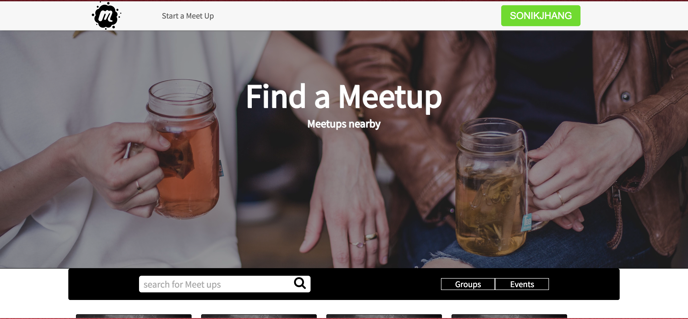
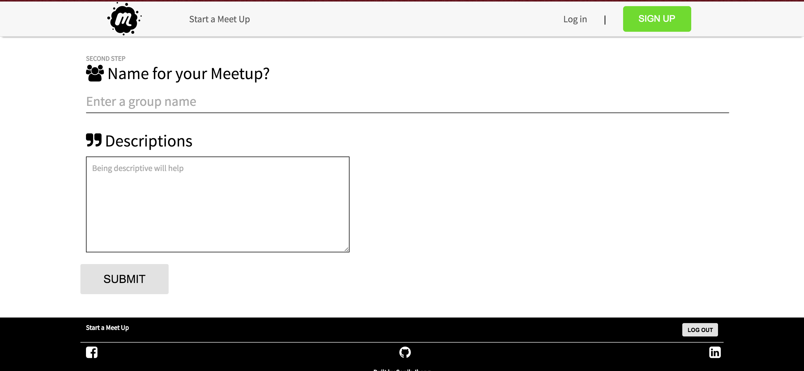
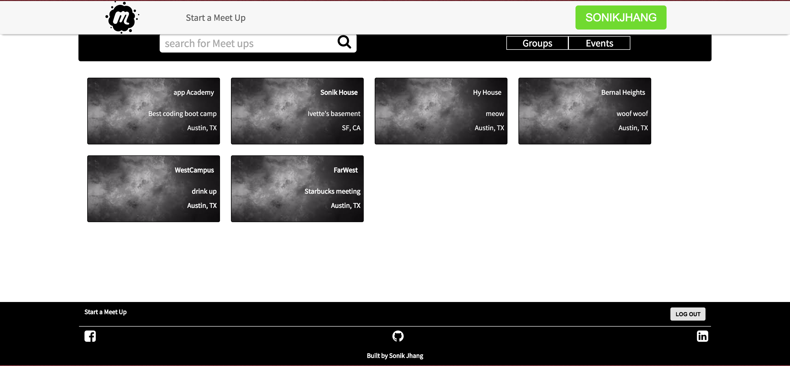
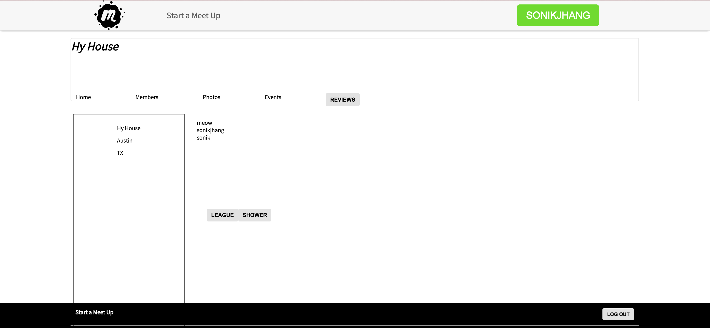
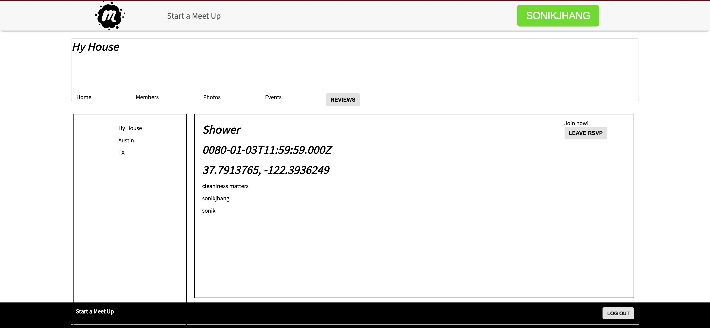
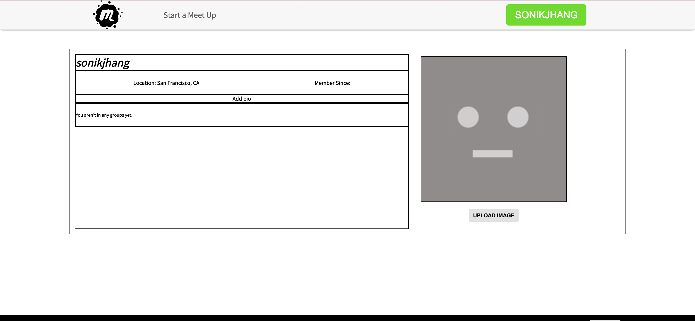

# Meetups

[Production link][production]

[production]: www.not-meetup.us

## Description:

This website is a clone of Meetup, [meetup]. Meetups allow users to search for groups with similar interests. Offers search by location and descriptions. Each groups hold event that clients can RSVP.

[meetup]: www.meetup.com

##Technology Stack

| Area               | Software      |
| ---------------    |:-------------:|
| Frontend           | React / Redux |
| Backend            | Rails         |
| Hosting      		   | Heroku        |
| Database Server	   | Cloudinary    |
| Repo      		     | GitHub        |

##Features

Authentications, Guest Login, Search location with autocompletion, group search with title, description, location, create group.

###Homepage

###Authentications

###Login homepage

###Group Create Page

###Group Index Page

###Group Show Page

###Event Show Page

###Profile Page

